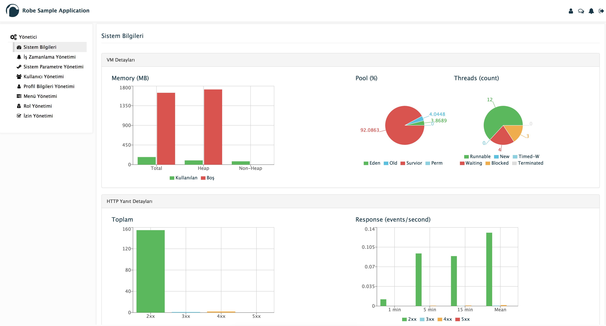

# Robe-React-Admin

#### Robe Admin UI Website

RRA = Robe-React-Admin

##### What's inside
* [Webpack](https://webpack.github.io/) for all development (server,hotload etc.) and build (package, optimize, etc.) needs.
* [Babel](https://babeljs.io/flow) for writing codes with ES6 syntax and transpiling them browser compatible codes. 
* [ESLint](http://eslint.org/) for protecting our nice formatted codes.
* [Karma](https://karma-runner.github.io/0.13/index.html) for testing.
* [React](https://facebook.github.io/react/) for ui.
* [Robe-React-UI](http://robeio.github.io/robe-react-ui/) for ui components
* [React-Bootstrap](https://react-bootstrap.github.io/) for ui components

##For Server Side
### Robe [more...](https://github.com/robeio/robe)

## Documentation

### Quick Start

#### 1. Get the latest version
You can start by cloning the latest version of RRU.

#### 2. Run `npm install`
This will install both run-time project dependencies and developer tools listed
in [package.json](./package.json) file.

#### 3. How to start project in Development Mode

This will start the development server and serve site application.

```shell
$ npm start
```
  
Open Browser and enter `http://localhost:8080` (default) 

### How to Build for Production

If you need just to build the app (without running a dev server), simply run:

```shell
$ npm run-script build
```
 
#####  How to run Unit Tests.

* Single Test Run with coverage for production.

```shell
$ npm test              # Run unit tests with Mocha
```

* Multi Test Run without coverage for development. 


```shell
$ npm run testd         # Run unit tests with Mocha
```
